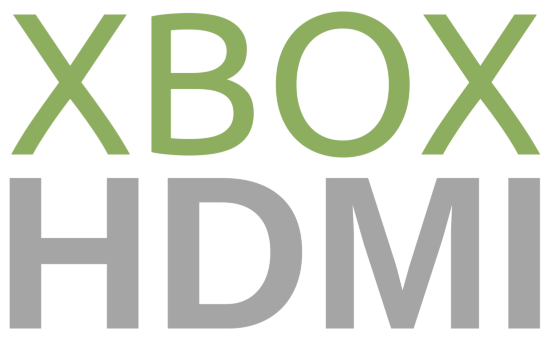

<h1 align="center">
   
  
   
</h1>
<h4 align="center">The first and only purely digital video output mod for the original Microsoft Xbox.</h4>

 
 
 
 

  <a href="#about">About</a> •
  <a href="#features">Features</a> •
  <a href="#installation">Installation</a> •
  <a href="#software">Software</a> •
  <a href="#hardware">Hardware</a> •
  <a href="#licensing">Licensing</a>

## About
The first and only purely digital video output mod for the original Microsoft Xbox. Video is captured directly off of the pixel data bus from the GPU, encoded, and sent directly to your HD TV with no added interpolation or frame-buffering for a crystal clear, no added lag, video output.

But pixel-perfect video isn't all the XboxHD+ offers. Audio is captured from the Xbox's digital SPDIF audio and output over the HDMI connector, and with the correct receiver allow for 5.1 Dolby Digital audio on select games.

XboxHD+ has been in development for over a year and fully tested on every board variation and revision.

## Features
XboxHD+ was designed from the ground up to be the best possible solution for your original Xbox.

  *  Pixel perfect digital video. Supports all official Xbox video resolutions. (480i, 480p, 576i, 720P, and 1080i)
  *  Crystal clear digital audio with surround-sound and Dolby Digital pass-through.
  *  Upgradable firmware via our Xbox application for additional future features, bug fixes, etc!
  *  HDMI CEC support.
  *  Completely reversible! 100% no-cut mod.
  *  Optional force 480P. (Force 480i games to run in 480p)
  *  Optional auto anamorphic widescreen for widescreen 480P content. By default, 16:9 480P content will be stretched to fullscreen as the game intended. Avoid the hassle of having to adjust your TV's zoom/aspect ratio when switch between widescreen and none-widescreen 480P games.

## Installation
**XboxHD+**

[Installation Manual (XboxHD+ 1.6)](/manual/Installation%20Manual%20(XboxHD%2B%201.6).md)

**XboxHDMI**

[Installation Manual (XboxHDMI 1.0 - 1.5)](/manual/Installation%20Manual%20(XboxHDMI%201.0%20-%201.5).md)

[Installation Manual (XboxHDMI 1.6)](/manual/Installation%20Manual%20(XboxHDMI%201.6).md)

## Software
Configuration and firmware updates are preformed using the XboxHD+ homebrew app.

See [MakeMHz/xbox-hd-plus-app](https://github.com/MakeMHz/xbox-hd-plus-app) (For XboxHD+ installs)

See [MakeMHz/xbox-hdmi-app](https://github.com/MakeMHz/xbox-hdmi-app) (For XboxHDMI installs)

## Hardware
### QSB Fix (1.0/1.1)
[KiCad Project](board/1_0_fix)

### 3D Printed Parts
The XboxHD+ kit includes two 3D printed parts. Parts are designed in Fusion360 and can be downloaded in multiple formats from the links below.

[HDMI Panel](https://a360.co/3l2h5Ya)

[Board Spacer](https://a360.co/30kox9a)

## Licensing
Parts of XboxHD+ are free and open source with plans to release everything else in the near future. Please respect the licenses available in their respective folders.

Hardware is shared under the CERN OHL version 1.2.
 
XboxHD+ configuration app was made with NXDK and is shared under GPLv2.
