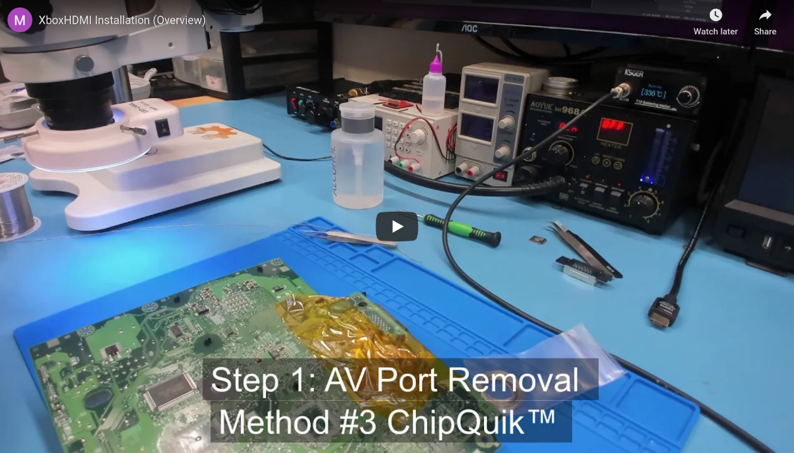
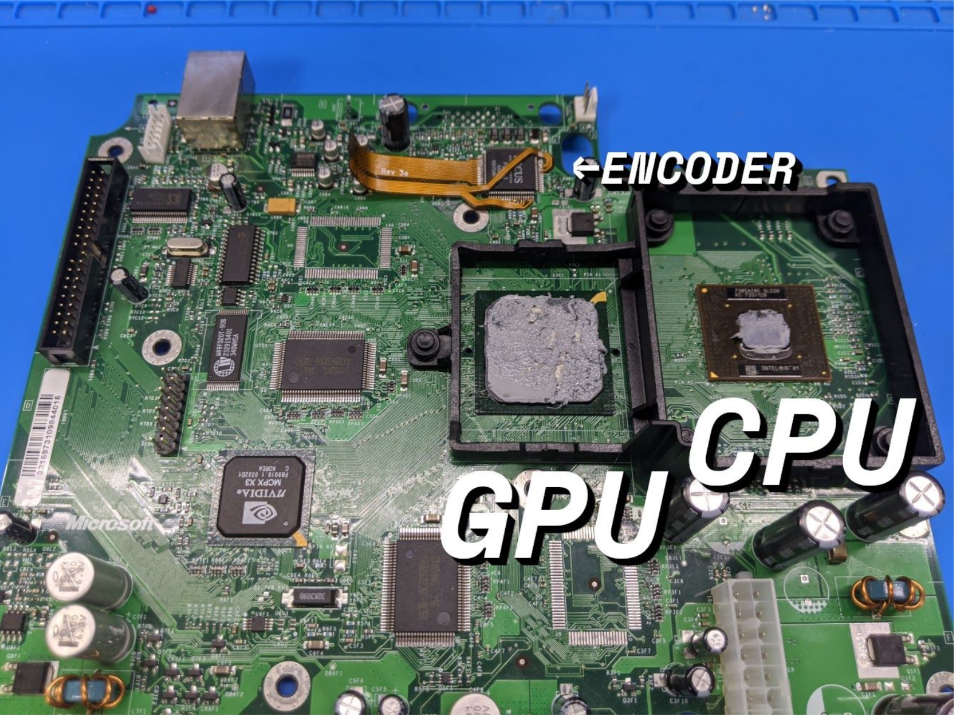
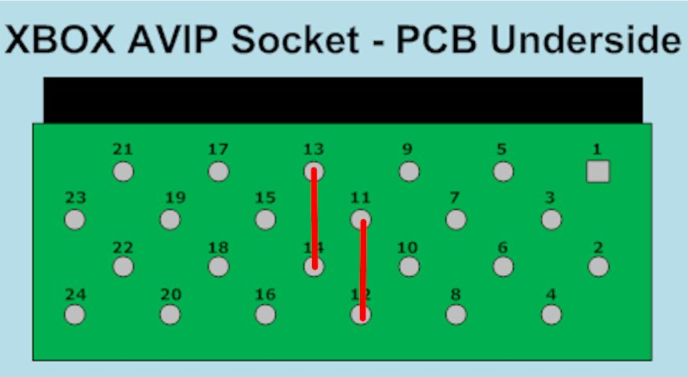
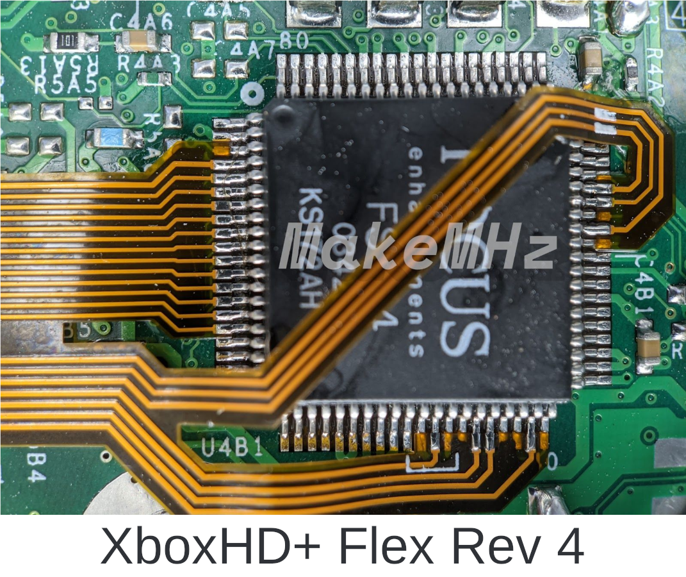
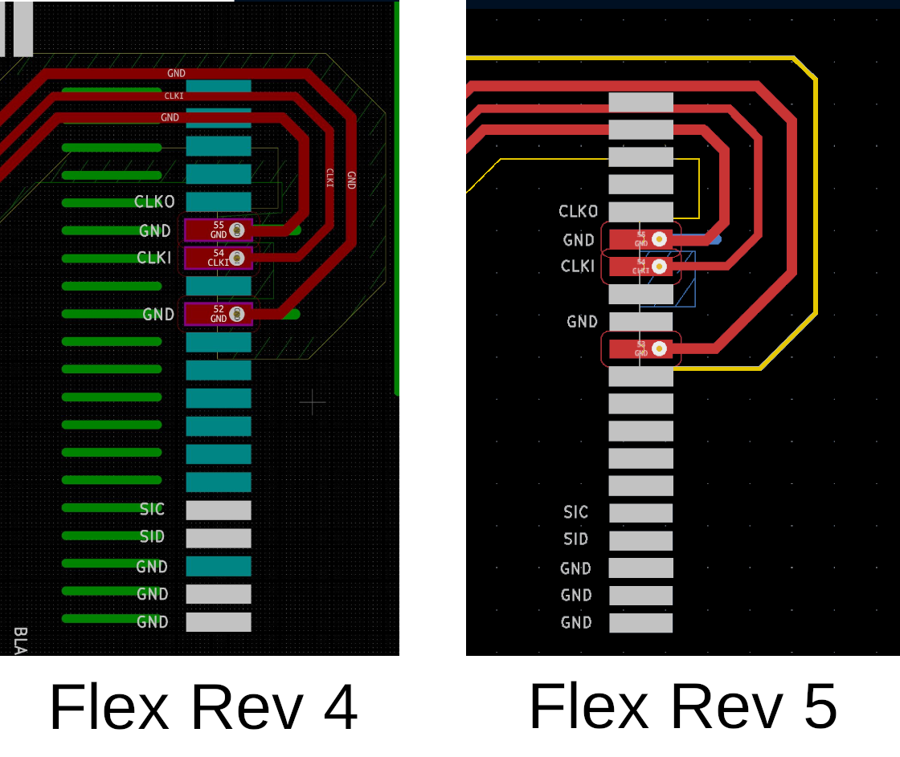
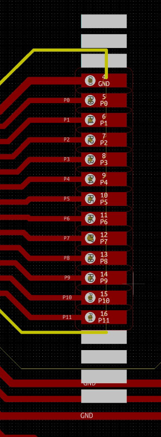
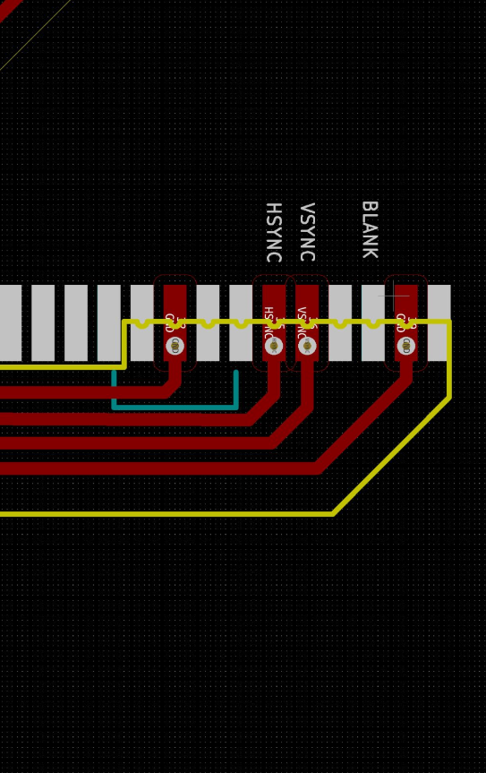
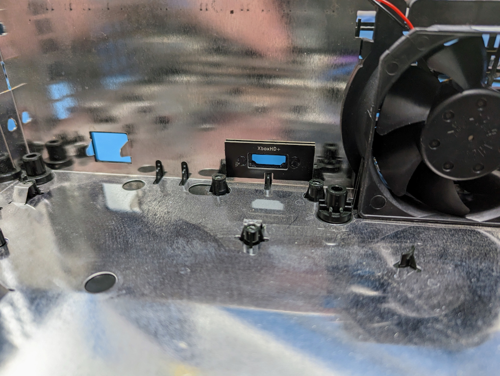
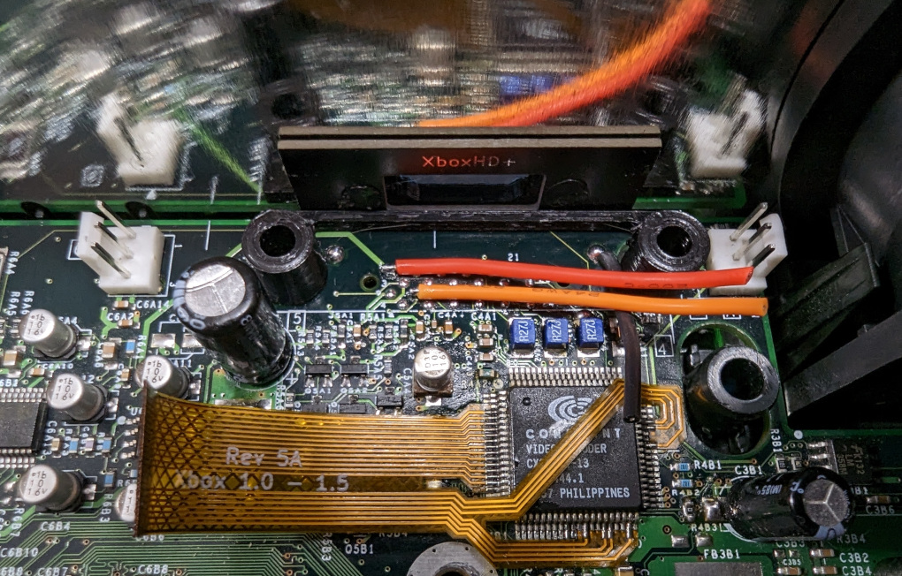

# Stellar XboxHD+ Installation Guide
### Xbox Revision 1.0 - 1.5
**This guide is ONLY for the installation of a Stellar XboxHD+ kit!**

- [Brief Overview](#brief-overview)
- [Preparation](#preparation)
  * [Kit Contents](#kit-contents)
  * [Wire Prep](#wire-prep)
  * [XboxHD+ Board Prep](#xboxhdmi-board-prep)
- [Step 1 - Software Installation](#step-1---project-stellar-installation)
- [Step 2 - QSB Installation](#step-2---qsb-installation)
- [Step 3 - Wire Prep](#step-3---wire-prep)
- [Step 4 - Motherboard Prep](#step-4---motherboard-prep)
- [Step 5 - Jumper Wires](#step-5---jumper-wires)
- [Step 6 - Flex Installation](#step-6---flex-installation)
- [Step 7 - Aux Wires](#step-7---aux-wires)
- [Step 8 - Wrapping Up](#step-8---wrapping-up)

### Brief Overview
For a brief overview, check out the YouTube video below.

https://bit.ly/339G98T

### Preparation
**Make sure to carefully read the entire document in full before you start! Familiarize yourself with all the steps and how they are to be carried out. Do not skip any steps, and use the provided pictures to compare your results.**

Before your adventure begins, it's imperative to ensure that you have a fully working, tested, and modified Xbox.

Please thoroughly test your system before attempting to install the XboxHD+ kit.
This guide also assumes that you watched the installation video linked above.

This guide is for Xbox motherboard revisions 1.0 - 1.5 with a Conexant or Focus encoder.

### Kit Contents
Check your kit for missing or damaged pieces before moving forwards.

- XboxHD+ Main Board
- XboxHD+ 1.0 - 1.5 Flex PCB
- XboxHD+ QSB for 1.0 - 1.5 consoles.
- 26AWG Stranded Red Wire for the 5V connection.
- 26AWG Stranded Orange Wire for the SPDIF connection.
- 26AWG Stranded Black Wire for the GND connection.
- 3D printed board spacer
- 3D printed HDMI port cover
- 2 mounting screws

### Step 1 - Project Stellar Installation
The first step of install the Stellar XboxHD+ is installing and updating Project Stellar. Project Stellar has it's own guide [here](https://github.com/MakeMHz/project-stellar/blob/main/documentation/Installation%20Guide.md).

**Make sure you're at least on firmware version v1.0.1 before continuing.**

### Step 2 - QSB Installation
**All Xbox revisions (1.0 - 1.5)** require the installation of a QSB board. Follow the [Installation Manual QSB HD+](Installation%20Manual%20QSB%20HD%2B.md) first before continuing.

### Step 3 - Wire Prep
It's imperative to cut each wire as close as possible to our recommendations, but not shorter. If additional wire is needed, then make sure to use wire of similar quality and gauge.

After cutting each wire, strip each side. It's recommended for the cleanest install to strip about 2mm from one side (for the connections to the Xbox motherboard) and about 3mm on the other side (for connections to the XboxHD+ board). Make sure to twist the stranded wires and pre-tin each one.

**Cut List and Lengths (end to end, before stripping)**

<table>
  <tr>
    <th>Black Wire</th>
    <td>3cm</td>
    <td>GND Connection</td>
  </tr>
  <tr>
    <th>Red Wire</th>
    <td>4cm</td>
    <td>5V Connection</td>
  </tr>
  <tr>
    <th>Orange Wire</th>
    <td>4cm</td>
    <td>SPDIF Connection</td>
  </tr>
</table>

### Step 4 - Motherboard Prep
The first step is to remove the motherboard from the Xbox. There are plenty of guides on the internet on how to do so and won't be repeated here as it's pretty straight-forward.

It's recommended that you remove the GPU heatsink since there's very little room between it and where the flex cable will be installed. We've found that the best approach is to apply very low heat to the heatsink, around 100°C / 212°F, while applying very light force twisting to the heatsink.

**It's very important not to force the heatsink off by attempting to pull it straight up as this could damage the GPU.** *(There's at least one person who's managed to do this in the past, unrelated to the project, and even though it's very unlikely, it's noted here to let others know to be careful!)*

The thermal compound on the GPU can be cleaned off with a basic solvent such as Arctic Silver Arcticlean Thermal Cooling Material Remover or with WD-40. When re-applying the heatsink, make sure to add **ample** PC thermal paste. *(in this case, more is better as a bit too much should not effect thermals and is ultimately safer as the GPU does not have an embedded thermal sensor for overheating protection).*

After this, you can remove the AV port. Please refer to the installation video for more information on the different ways to accomplish this.

And finally, make sure to clean the area where the flex will be installed with IPA.

<i><b>Note that removing the CPU heatsink is not required.</b></i>

### Step 5 - Jumper Wires
This step gets its own section as it's very easy to forget, and can be a pain if forgotten since the pins are located on the bottom of the board.

We need to make two connections on the bottom of where the AV port used to be, so that the Xbox thinks that an HD AV cable is plugged in. Use a scrap piece of wire to make these connections.

### Step 6 - Flex Installation
This section will be mostly screenshots of the Xbox video encoder and where the flex connects. Pay close attention to the alignment of the flex cable and **take your time while installing!**

After the flex is installed, the Xbox should still be bootable.

#### Best Practices
- Pre-tin both sides of the flex by applying ample flux and running solder across each pad before soldering to the Xbox motherboard.
- Pre-shape the flex. Gently shape the flex so it's close to the final shape before soldering. The flex must lay flat and properly aligned when installed.
- Take your time!

#### Important
**Proper flex positioning and soldering is crucial to allow for good contact. Make sure your flex lies flat on the board, do not solder it on top of the encoder chip pins! Inspect all solder joints before continuing, make sure they are well-formed and do not touch each other.**

#### Warning!
**There are multiple revisions of the XboxHD+ flex revision. Please pay close attention to the reference images below.**

**Completed Install**

**Overview View**

**Right Connections**

**Left Connections**

Flex rev 1-5 are the same on the left side.

**Bottom Connections**

Flex rev 1-5 are the same on the bottom side.

### Step 7 - Aux Wires
Start with connecting each of the pre-cut wires. The wires for 5V and SPDIF should lay flat across the motherboard running towards the right.

#### AV Port/Encoder Connections
Connect each of the pre-cut wires according to the wire cut chart above. The wires for 5V and SPDIF should lay flat across the motherboard running to the right. The wire for GND should run downwards.

### Step 8 - Wrapping Up

#### 3D Printed HDMI Panel
Insert the 3D printed HDMI part in the Xbox case as pictured below.

### Re-install the Xbox Motherboard
Place the Xbox motherboard back into the case. Make sure to screw the motherboard back in. There's one screw located under where the XboxHD+ will be installed.

#### 3D Printed Spacer
Place the provided spacer as shown below.

### Install the XboxHD+ Board
Begin by adding solder to all of the connection pads (GND, SPDIF, 5V). This is important as there's little room once everything is installed.

Place the XboxHD+ board in the system and screw it down with the two provided screws.

**Make sure to use the two provided torx screws. A longer philips head screw is provided for Project Stellar, but will cause case damage if installed for the HD+**

Connect each wire to its corresponding pads on the XboxHD+ board.

Carefully connect the flex cable to the FPC connector. Be very careful. it may take a couple of tries as sometimes the flex will want to go in at an angle. if this happens, then pull it out and gently push it back in. ***Do not force it in. Make sure the flex is not inserted at an angle!***

Connect the Stellar link cable from the Project Stellar to the XboxHD+. It is recommended to connect the cable to Stellar while it's not on the pin header to avoid unnecessary stress on pin header.

