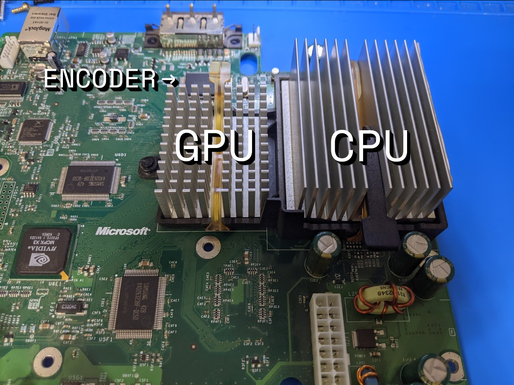
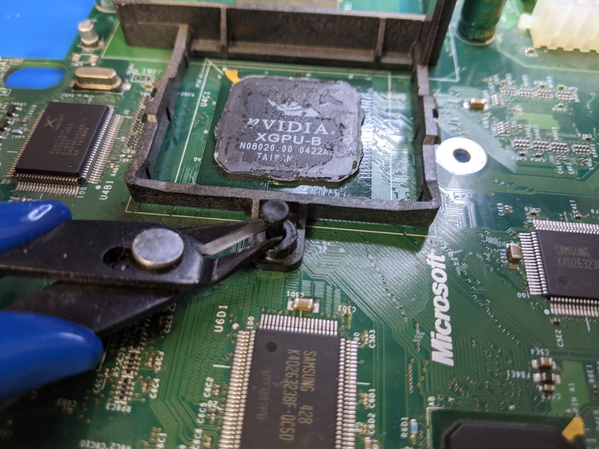
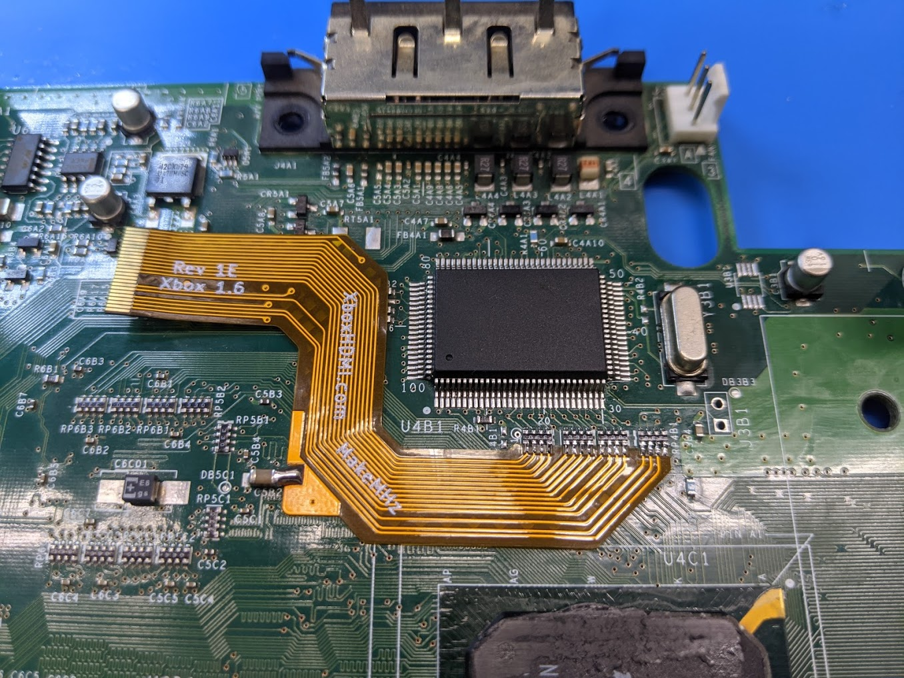
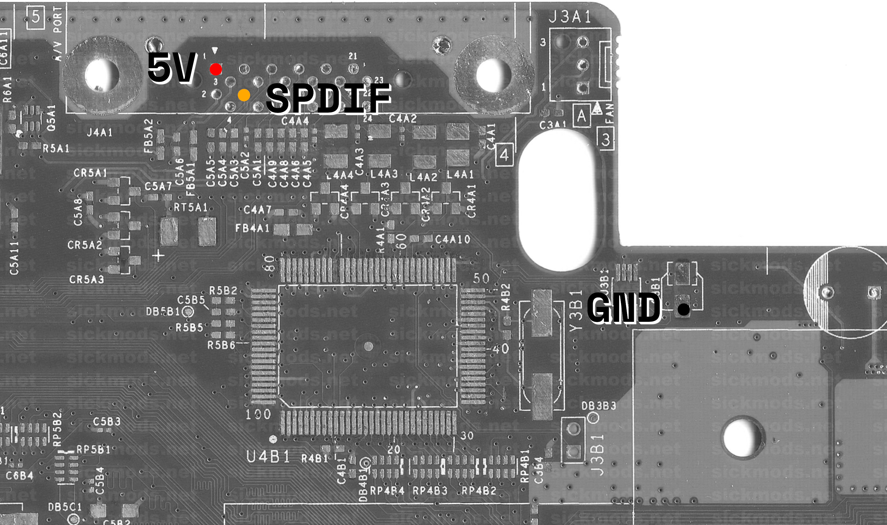
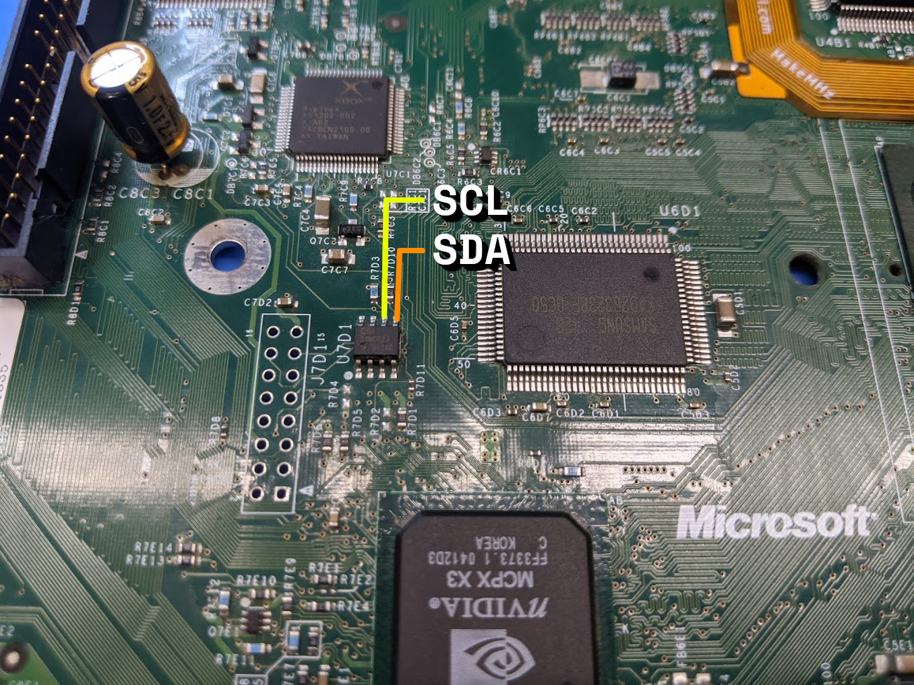
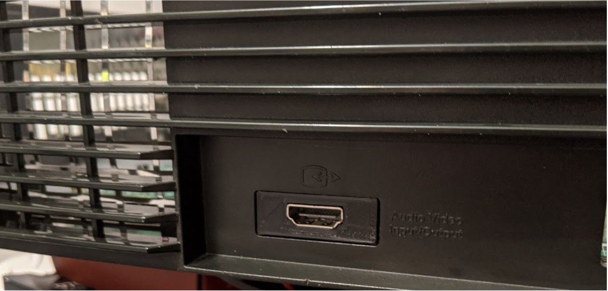
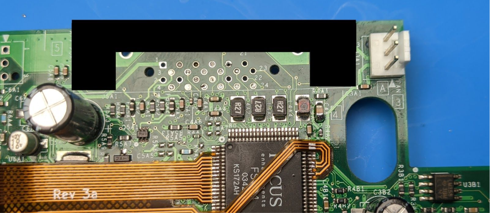
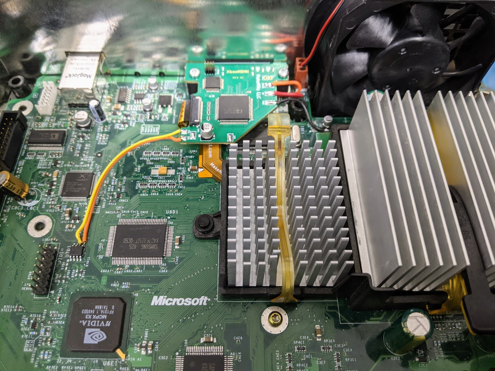

# XboxHDMI Installation Guide
### Xbox Revision 1.6

- [Brief Overview](#brief-overview)
- [Preperation](#preperation)
  * [Kit Contents](#kit-contents)
  * [Wire Prep](#wire-prep)
  * [XboxHDMI Board Prep](#xboxhdmi-board-prep)
- [Step 1 - Motherboard Prep](#step-1---motherboard-prep)
- [Step 2 - Jumper Wires](#step-2---jumper-wires)
- [Step 3 - Flex Installation](#step-3---flex-installation)
- [Step 4 - Aux Wires](#step-4---aux-wires)
- [Step 5 - Wrapping Up](#step-5---wrapping-up)

### Brief Overview
For a Brief Overview, Please visit the YouTube video below.

https://bit.ly/339G98T

### Preperation
Before your adventure begins, it's imperative to ensure that you have a fully working, tested, and modified Xbox.

Please thoroughly test your system before attempting to install the XboxHDMI kit.
This guide also assumes that you watched the installation video linked above.

This guide is for Xbox motherboard revisions 1.6 with a Xcalibur video encoder.
**
Apply the kernel patches and verify it's activated by running the XboxHDMI application on the Xbox before teardown!
**

https://github.com/MakeMHz/xbox-hdmi/blob/master/patches/README.md

### Kit Contents
Check your kit for missing or damaged pieces before moving forwards.

- XboxHDMI Main Board
- XboxHDMI Flex PCB
- 26AWG Stranded Red Wire for the 5V and 1.8V connections.
- 26AWG Stranded Orange Wire for the SPDIF connection.
- 26AWG Stranded Black Wire for the ground connections.
- 22AWG paired Wire for the SMBus connection.
- 3D printed board spacer
- 3D printed HDMI port cover
- 2 replacement screws

### Wire Prep
It's imperative to cut each wire as close as possible to our recommendations, but not shorter. if additional wire is needed then make sure to use wire of similar quality and gauge.

After cutting each wire, strip each side of the wires. It's recommended for the cleanest install to strip about 2mm from one side (for the connections to the Xbox motherboard) and about 3mm on the other side (for connections to the XboxHDMI board). Make sure to twist the stranded wires and pre-tin each one.

**Cut List and Lengths (end to end, before stripping)**

<table>
  <tr>
    <th>Black Wire</th>
    <td>28mm</td>
    <td>GND 1 Connection Near the SPDIF pad</td>
  </tr>
  <tr>
    <th>Red Wire</th>
    <td>35mm</td>
    <td>1.8V Connection</td>
  </tr>
  <tr>
    <th>Red Wire</th>
    <td>48mm</td>
    <td>5V Connection</td>
  </tr>
  <tr>
    <th>Orange Wire</th>
    <td>45mm</td>
    <td>SPDIF Connection</td>
  </tr>
  <tr>
    <th>Paired Wire</th>
    <td>90mm</td>
    <td>SMBus Connection</td>
  </tr>
</table>

### XboxHDMI Board Prep
Begin by adding solder to all of the connection pads (GND, SDA, SCL, SPDIF, 1V8, 5V). This is important as there's little room once everything is installed.

### Step 1 - Motherboard Prep
The first step is to remove the motherboard from the Xbox. There are plenty of guides on the internet on how to do so and won't be repeated here as it's pretty straight-forward.

It's required to remove the CPU heatsink, GPU heatsink, and the motherboard heatsink mounting bracket. We've found that the best approach is to apply very low heat to the heatsink, around 100°C / 212°F, while applying very light force twisting to the heatsink.

**It's very important not to force the heatsinks off by attempting to pull them straight up as this could cause damage.** *(There's at least one person who's managed to do this in the past, unrelated to the project, and even though it's very unlikely, it's noted here to let others know to be careful!)*

The thermal compound on the GPU can be cleaned off with a basic solvent such as Arctic Silver Arcticlean Thermal Cooling Material Remover or with WD-40. When re-applying the heatsink, make sure to add **ample** PC thermal paste. *(in this case, more is better as a bit too much should not effect thermals and is ultimately safer as the GPU does not have an embedded thermal sensor for overheating protection).*

Next up is removing the heatsink mount. The pins can be a bit tricky to pop out. We've found that using side cutters to wedge them out works nicely. (Just becareful not to cut them)

With the pins removed the heatsink mount can be removed by pushing it out from the back.

After this, you can remove the AV port. Please refer to the installation video for more information on the different ways to accomplish this.

And finally, make sure to clean the area where the flex will be installed with IPA.

### Step 2 - Jumper Wires
This step gets its own section as it's very easy to forget, and can be a pain if forgotten since the pins are located on the bottom of the board.

We need to make two connections on the bottom of where the AV port used to be, so that the Xbox thinks that an HD AV cable is plugged in. Use a scrap piece of wire to make these connections.

### Step 3 - Flex Installation
This section will be mostly screenshots of the Xbox video encoder and where the flex connects. Pay close attention to the alignment of the flex cable and **take your time while installing!**

Start with soldering the flex unto the resistor network and then solder the ground pad last. Unlike the 1.0 - 1.5, the 1.6 flex does not have pads on the bottom of the flex. Make sure you have solid joints!

After the flex is installed, the Xbox should still be bootable.

#### Best Practices
- Pre-tin the top side of the flex by applying ample flux and running solder across each pad before soldering to the Xbox motherboard.
- Take your time!

**Completed Install**

### Step 4 - Aux Wires
Start with connecting each of the pre-cut wires. The wires for 5V and SPDIF should lay flat across the motherboard running towards the right.

#### AV Port/Encoder Connections
Connect each of the pre-cut wires according to the wire cut chart above. the wires for 5V and SPDIF should lay flat across the motherboard running to the right.

#### SMBus Connections (SDA and SCL)
Using the paired wire connect one wire to each side of the PIC16.

### Step 5 - Wrapping Up

#### 3D Printed HDMI Panel
Insert the 3D printed HDMI part in between the metal shielding and the Xbox case.

#### 3D Printed Spacer
Place the spacer as shown below in black.

<b><i>I forgot to take a photo for the manual... MSPaint works though.</b></i>

### Re-install the Xbox Motherboard
Place the Xbox motherboard back into the case. Make sure to screw the motherboard back in.

### Install the XboxHDMI Board
Place the XboxHDMI board in the system and screw it down with the two provided screws.

Connect each wire to their corresponding pads on the XboxHDMI board.

Carefully connec the flex cable to the FPC connector. Be very careful. it may take a couple of tries as sometimes the flex will want to go in at an angle. if this happens, then pull it out and gently push it back in. ***Do not force it in. Make sure the flex is not inserted at an angle!***

