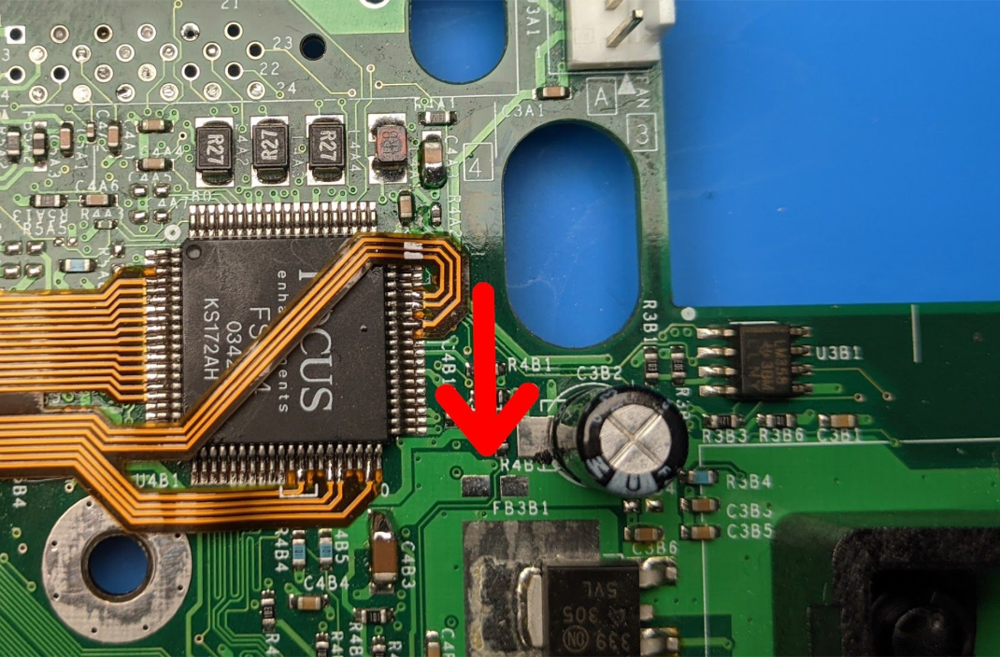
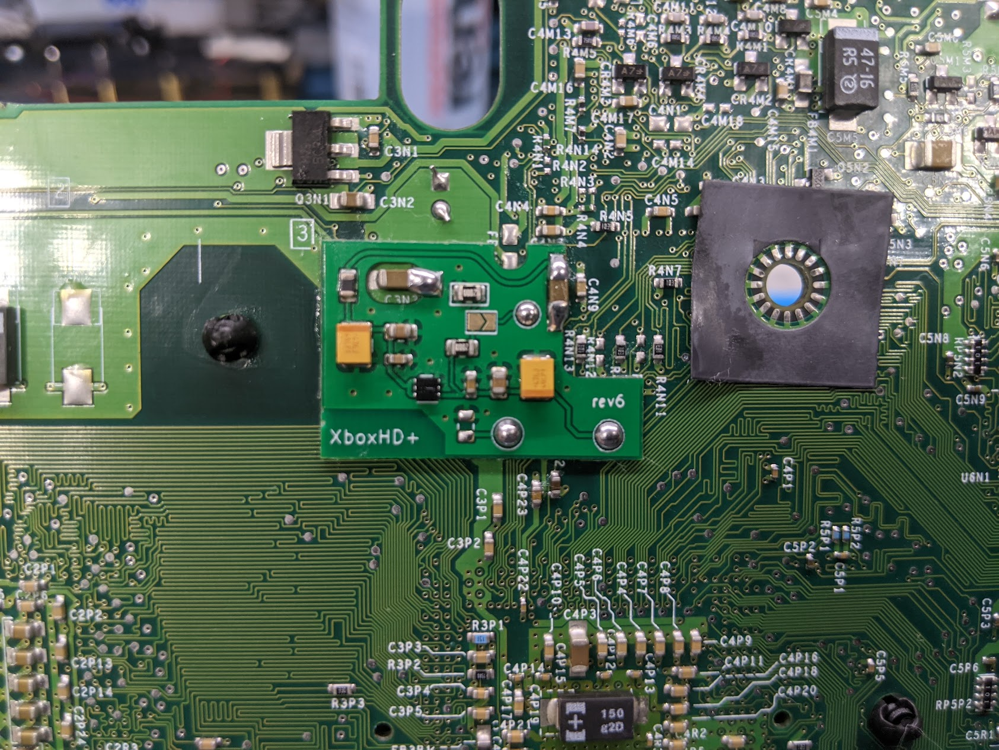
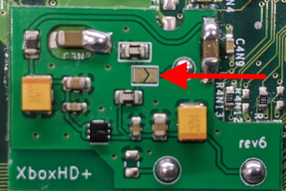

# Installation Manual QSB HD+
### Xbox Revision 1.0 - 1.5

### Brief Overview
Xbox motherboard revisions 1.0 - 1.5 require an additional QSB board for signal conditioning.

#### Ferrite Bead Removal
Next to the Video encoder on the top side of the motherboard is a ferrite bead, labeled FB3B1, that needs to be removed. This can be easily done by heating it up with a soldering iron and a bit of solder. (Save the ferrite bead incase you choose to remove the HD+ in the future.)

### Installation
The QSB solders on to the bottom side of the Xbox motherboard.

Start by soldering each connection. After soldering the first connection use a pair of tweezers to hold the board as flat as possible while making the other connections. (The Xbox motherboard has a slight curve to it do the CPU/GPU mounts)

### Xbox 1.0/1.1 Instructions
Additionally, Xbox revisions 1.0 and 1.1 require that this point be bridged.

[Identifying Xbox Revision](/manual/Identifying%20Xbox%20Revision.md)

### Verification/Troubleshooting
Installation verification can be performed by measuring the resistance using the chart below.

| Connection 1        | Connection 2       | Resistance |
| ------------------- | ------------------ | ---------- |
| 🟠 CLKI             | ⚫ GND             | <= 200 ohm |
| 🟠 CLKI             | 🔴 VIDEO_1v5 (QSB) | <= 200 ohm |
| 🔴 VIDEO_1v5 (XBOX) | 🔴 VIDEO_1v5 (QSB) | ~0 ohm |

### Testing
It's very important at this step to reassemble the system and test. If possible use an HD cable or external HDMI adapter and test with games running at 720p or 1080i. This will help rule out bad/failing system capacitors.

The system should perform as usual. If not (stuttering/lockups), higher chance on 1.0/1.1 systems, then the system may need to be fully recapped.

### Other Important Notes
If the XboxHD+ QSB is being installed alongside the original XboxHDMI kit, do NOT connect the 1v8 wire from the XboxHDMI board to the motherboard, as this can damage the XboxHDMI board.

