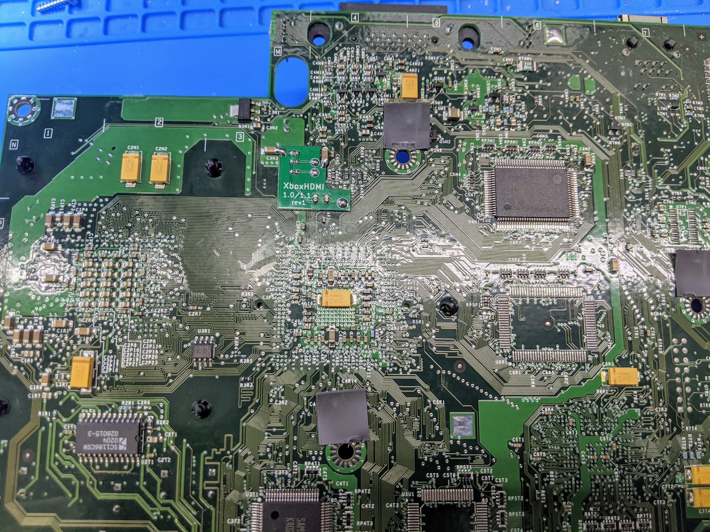
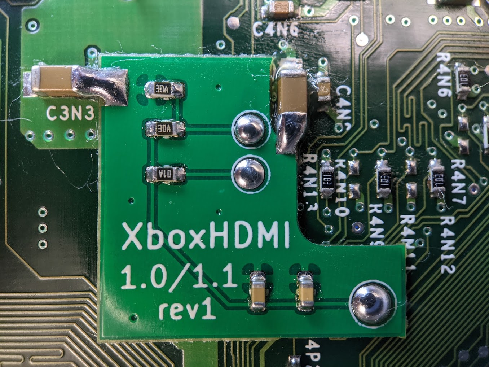
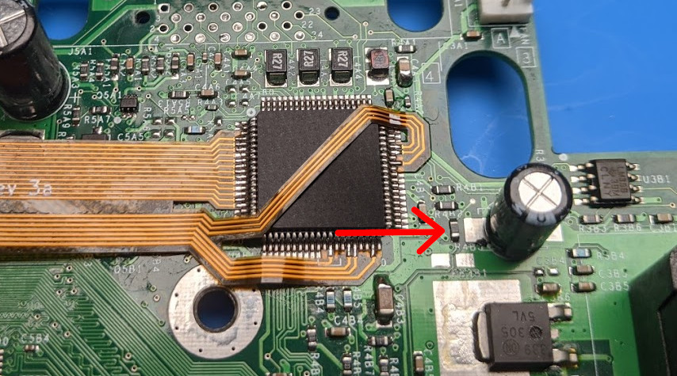
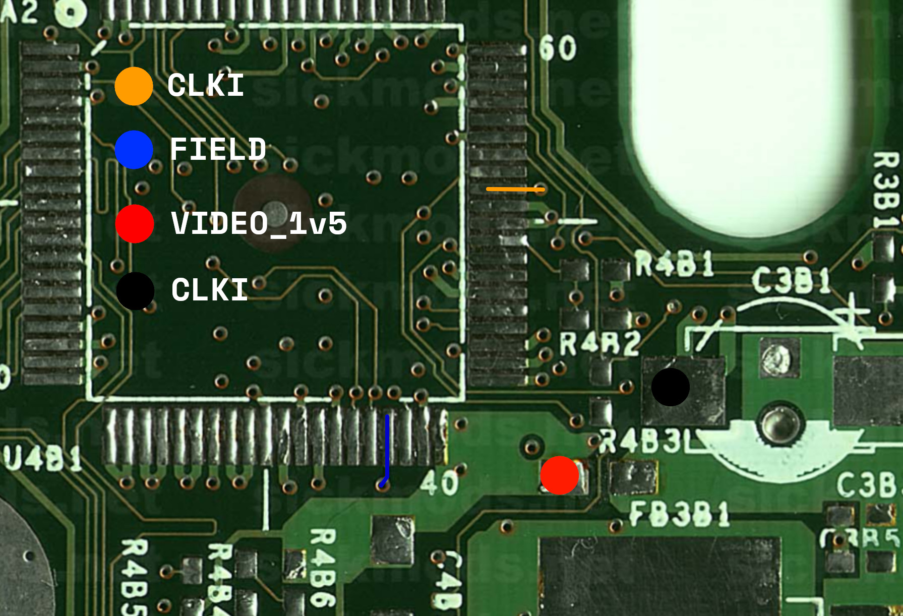

# Installation Manual QSB
### Xbox Revision 1.0 - 1.1

### Brief Overview
Xbox motherboard revisions 1.0 and 1.1 require an additional QSB board for signal conditioning.

### Installation
The QSB solders on to the bottom side of the Xbox motherboard.

Start by soldering each connection. After soldering the first connection use a pair of tweezers to hold the board as flat as possible while making the other connections. (The Xbox motherboard has a slight curve to it do the CPU/GPU mounts)

On the top side of the motherboard is a single resistor that needs to be swapped out. Included with the QSB kit is a 47ohm resistor.

### Verification/Troubleshooting
Verification and troubleshooting can be performed by measuring the resistance using the chart below.

| Connection 1 | Connection 2 | Resistance |
| ------------ | ------------ | ---------- |
| 🟠 CLKI         | ⚫ GND          | <= 200 ohm |
| 🟠 CLKI         | 🔴 VIDEO_1v5    | <= 200 ohm |
| 🔵 FIELD        | 🔴 VIDEO_1v5    | <= 100 ohm |

