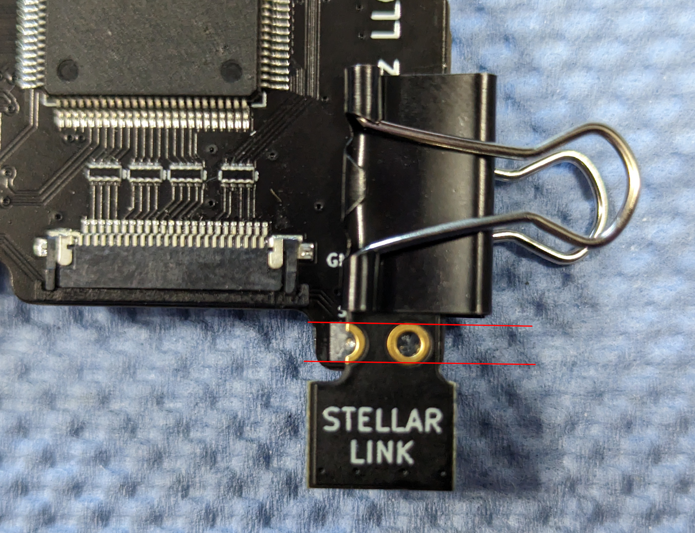
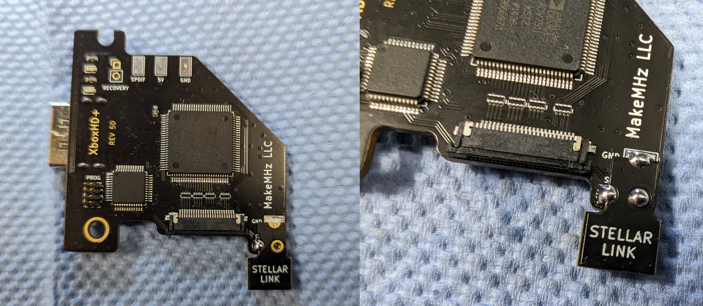

# Upgrading to Stellar XboxHD+
This guide is for upgrading existing XboxHDMI and XboxHD+ installs to work with Project Stellar.

## Checklist
- [ ] Latest XboxHD+ Firmware
- [ ] System is fully working.
  - [ ] System has no stablity issues.

**Contact support if you have any questions or concerns.**

### Step 1:
Update the XboxHDMI/XboxHD+ to firmware version 2.2.0 or higher.

### Step 2:
Disconnect the HDMI board from the system. Remove and clean the solder from the SDA, SCL, and GND pads.

**Remove the SDA and SCL wires from the Xbox motherboard. These are no longer needed**

### Step 3:
Using the provided binder clip, align the PCB over the pads. Pay close attention and line up the pads and through holes so they sit both parallel and centered.

This step is tricky and will take a couple of minutes to line up perfectly. Taking the time to get right on the first try is well worth it.

### Step 4:
Solder the SCL connection first. Once that pad is soldered, remove the binder clip and check the aligment. If the alignment is off then desolder the SCL connection and re-align the board.

### Step 5:
Clean up the board and check for shorts between SDA, SCL, and GND. Re-install the XboxHD+.

Connect the Stellar link cable from the Project Stellar to the XboxHD+. It is recommended to connect the cable to Stellar while it's not on the pin header to avoid unnecessary stress on pin header.

Project Stellar can now be installed. Project Stellar has it's own installation guide [here](https://github.com/MakeMHz/project-stellar/blob/main/documentation/Installation%20Guide.md).

## Closing Notes
- The XboxHD+ app is no longer used once Project Stellar is installed and settings can be adjusted from StellarOS.
- The installation can be reversed.
